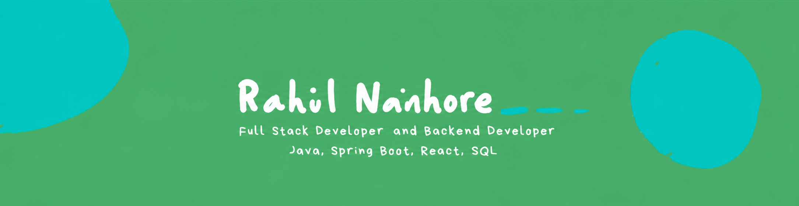

### Hi there 👋

I’m **Rahul Nanhore**, a Full Stack Developer focused on building practical, scalable web applications. I enjoy turning ideas into clean, reliable software and solving problems through code.

💻 I’m currently working with **Java**, **Spring Boot**, **JavaScript** and **React** while building full-stack projects.  
🚀 I’m currently working on project **CareerOrbit**.  
🚀 I’m exploring **Microservices**, **Web Security**, **JWT**, **Docker**, and modern backend architecture.  
🌱 I’m looking forward to learning **DevOps**.  
🧠 I’m currently learning best practices in software development while sharpening my problem-solving skills through real-world projects.  
😄 Pronouns: he/him  
⚡ Fun fact: I enjoy solving challenging bugs and feel excited when everything finally works 😄  

 

  

